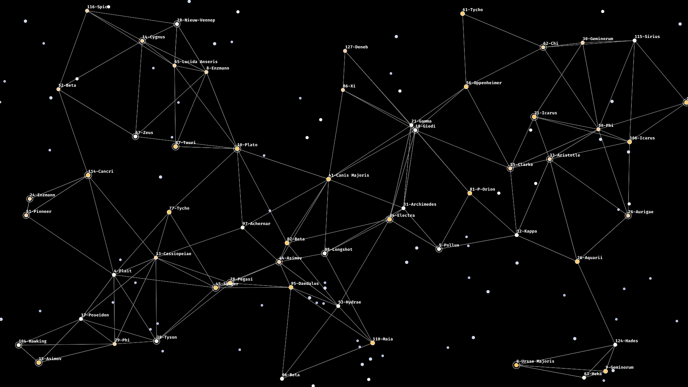

# stars



A simple starmap generator in Golang

## Usage 

By default, running `stars` will output a 1080p image called `stars.png` to the current directory.

In addition, it supports the following arguments:

```
  -filename string
        the filename of the output (default "stars.png")
  -x int
        Horizontal size of image (default 1920)
  -y int
        Vertical size of image (default 1080)
```

## Legal stuff

Copyright 2024 by Annaia Danvers

Licensed with the Affero GPL 3.0

No, I will not change this for your startup.